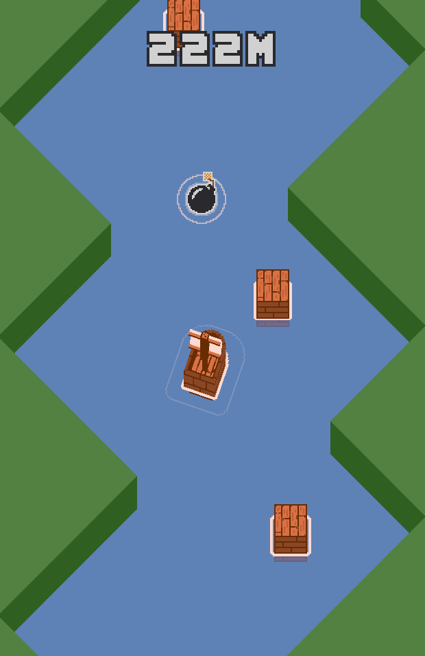

# Boat

Author: Alton Olson

Design: The game combines rotation/thrust controls with momentum (similar to Asteroids) with an infinite-runner obstacle avoiding challenge (similar to Helicopter/Flappy Bird).

Screen Shot:

How To Play:

Arrow keys to move (L/R rotates, U/D thrust forward and backward). Avoid the river banks, you can hit the boxes but not the bombs, and don't get left behind by the camera. My high score is 786m :).

This game was built with [NEST](NEST.md).
